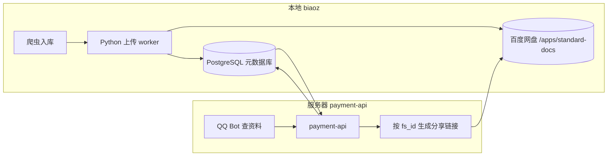

# 百度网盘双端共用方案

本地 **biaoz**（入库/上传）与服务器 **payment-api**（QQ 群下载/分享）共用同一百度网盘账号与目录规范。

## 已部署资源

| 位置 | 路径 |
|------|------|
| 本地 | `openxpanapi/`（PHP SDK + `账户信息.txt`） |
| 服务器 | `/home/ubuntu/openxpanapi/` |
| 软链 | `/home/ubuntu/payment-api/openxpanapi` → 同上 |

部署命令：

```powershell
# Git Bash / WSL
bash deploy/remote-payment-api/deploy_openxpanapi.sh
```

## 两个地方各自做什么



| 端 | 职责 | 实现 |
|----|------|------|
| **本地 biaoz** | 抓取 PDF → 算 sha256 → 上传到网盘 → 写 `baidupan:/...` 或 `remark` 里 `baidu_pan_sync=` | `backend/app/baidu_pan_storage.py`（Python httpx，**不依赖 PHP**） |
| **服务器 payment-api** | 用户扣券后，从 PG 查标准 → 解析 `fs_id` → 调分享 API 发链接 | `library/baidu_remark.py` + `metadata_search.create_baidu_share_link` |

**结论**：网盘是共用的；上传在本地，下载分享在服务器。数据库里的 `file_path` / `remark` 是两边对齐的「索引」。

## 凭证怎么共用

两边读同一套 OAuth 信息即可（同一百度开放平台应用）：

| 来源 | 本地 | 服务器 |
|------|------|--------|
| 账户文件 | `openxpanapi/账户信息.txt` | `/home/ubuntu/openxpanapi/账户信息.txt` |
| 环境变量 | `BAIDU_PAN_*` | 建议在 `payment-api/.env` 增加 |

建议在 `账户信息.txt` 中补充（或通过 env 注入）：

```text
refresh_token: <授权后获得>
access_token: <可选，会自动刷新>
```

服务器 `payment-api/.env` 示例：

```env
BAIDU_PAN_ACCOUNT_FILE=/home/ubuntu/openxpanapi/账户信息.txt
BAIDU_PAN_ROOT=/apps/standard-docs
# 与 create_baidu_share_link 兼容（可二选一，推荐统一走 account file + Python 封装）
BAIDU_NETDISK_ACCESS_TOKEN=
```

本地 `settings` 里已有 `baidu_pan_account_file: ./openxpanapi/账户信息.txt`，与服务器路径对称。

## PHP SDK 还要不要用？

| 组件 | 语言 | 说明 |
|------|------|------|
| `openxpanapi/` | PHP | 百度官方 SDK，含 `vendor/`，适合 PHP 脚本或对照 API |
| `baidu_pan_storage.py` | Python | **实际上传/下载**已在用 REST，与 SDK 能力等价 |

服务器 **payment-api 是 Python**，日常不必跑 PHP。复制 SDK 的主要价值：

1. **统一存放** AppKey / Secret / token 的 `账户信息.txt`
2. 保留官方 demo，必要时 `php demo/XpanMain.php` 做联调
3. 若以后要 PHP 运维脚本，可直接 `require vendor/autoload.php`

如需 PHP CLI：`sudo apt install php-cli`（当前服务器未装）。

## 目录规范（两边必须一致）

见 `docs/baidu-pan-storage-design.md`：

```text
/apps/standard-docs/objects/sha256/ab/cd/<sha256>.pdf
```

`BAIDU_PAN_ROOT` 本地与服务器都设为 `/apps/standard-docs`。

## 分享链接 API

服务器创建分享链接使用官方 **apaas** 接口（非旧版 `xpan/share`）：

- 文档：<https://pan.baidu.com/union/doc/Tlaaocmkj>
- 路径：`POST /apaas/1.0/share/set?product=netdisk&appid=...&access_token=...`
- 必填 body：`fsid_list`（JSON 数组）、`period`、`pwd`（4 位数字+小写字母）
- 实现：`deploy/remote-payment-api/library/baidu_client.py` → `create_share_link()`

## 推荐下一步（讨论项）  
   账户文件里目前只有 AppKey/SecretKey，需完成 OAuth 授权并写入 `refresh_token`，两边才能自动换 `access_token`。

2. **服务器统一 Python 客户端**  
   把 `baidu_pan_storage.py` 精简版拷到 `payment-api/library/`，让分享链接也走同一套 refresh 逻辑，而不是单独的 `BAIDU_NETDISK_ACCESS_TOKEN`。

3. **token 同步**  
   - 简单方案：两边共用同一 `账户信息.txt`，refresh 后写回文件（需注意并发）  
   - 稳妥方案：token 只放服务器，本地 upload worker 通过内网 API 代理（复杂，后期再做）

4. **验证链路**  
   - 本地：某条 `document_version` 已有 `baidupan:` URI  
   - 服务器：`resolve_metadata_share(document_id)` 能返回 `pan_share_url`

你更倾向哪种 token 方案？确认后我可以把服务器 `.env` 和 Python 分享模块接好。
